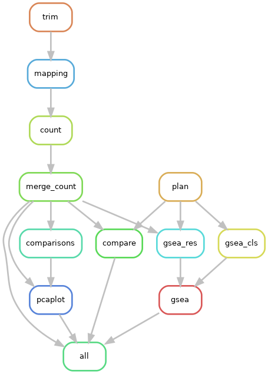

# dxpipe

## 流程总览



## 依赖安装

使用 mamba 自动安装所有依赖（conda 的加速替代）

```bash
conda install -n base -c conda-forge mamba
mamba env create -f environment.yml
conda activate dxpipe
```

之后安装 GSEA
```bash
sh tools/install_gsea.sh
```

## 运行流程

首先需要创建一个本次分析的配置文件

```bash
mkdir project
cd project
cp dxpipe/config.yaml .
```

浏览检查配置文件内的所有配置项（所有配置项都是必须的），并按照注释进行更改。然后运行流程

```bash
snakemake --snakefile dapipe/Snakefile -j 10 --configfile config.yaml
```

其中的 `-j` 是允许流程使用的最大进程数。
